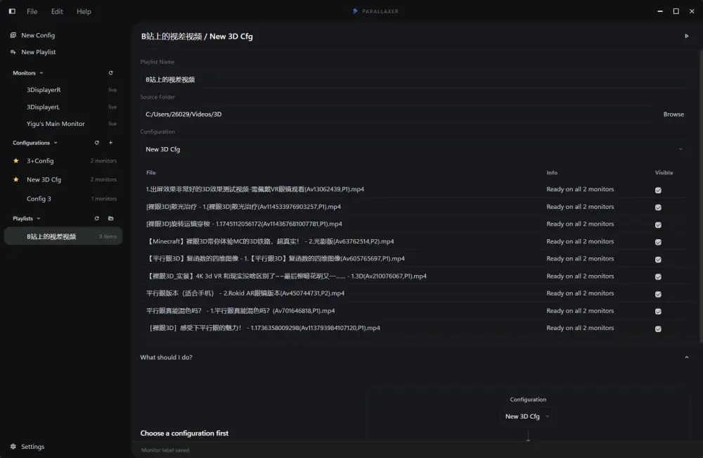
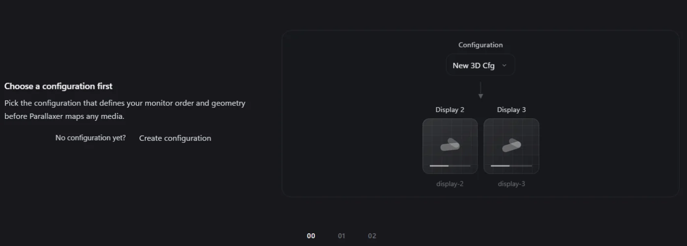
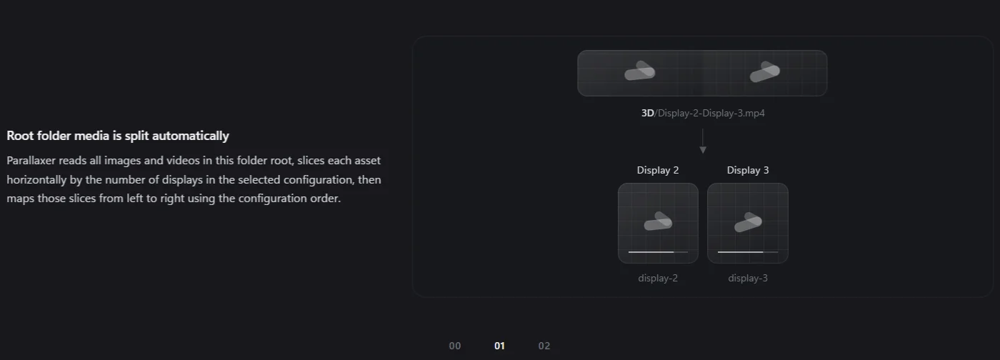
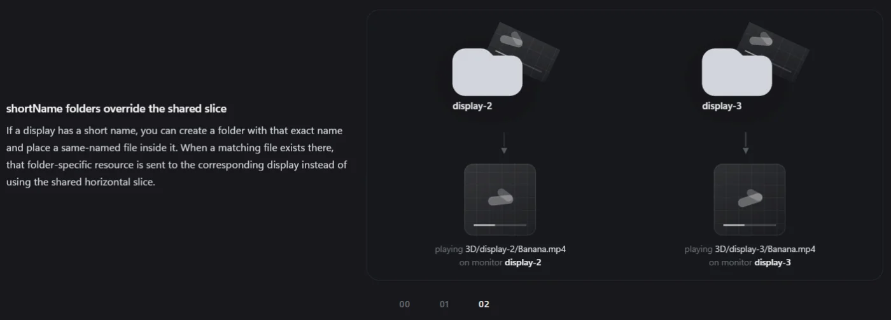
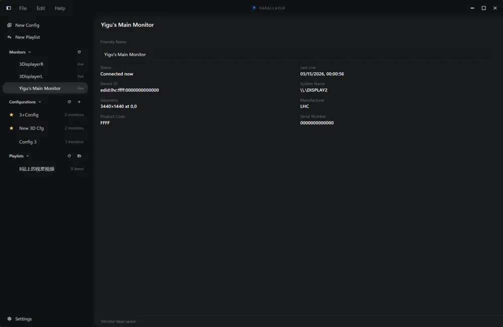
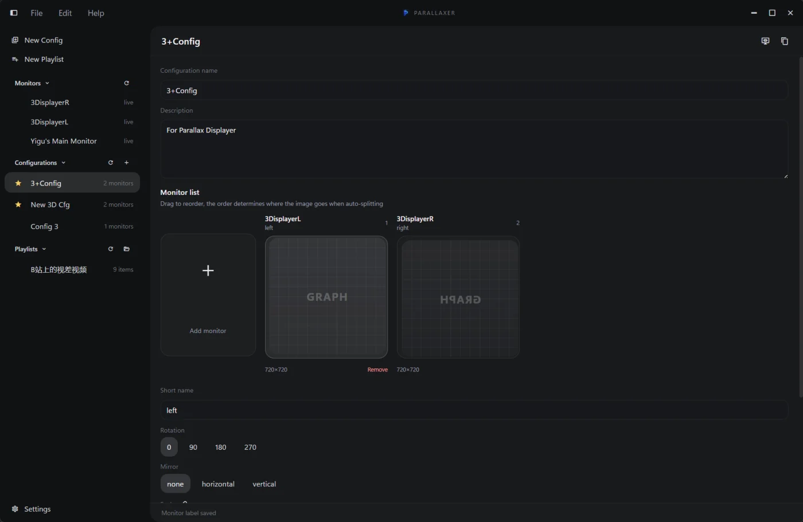
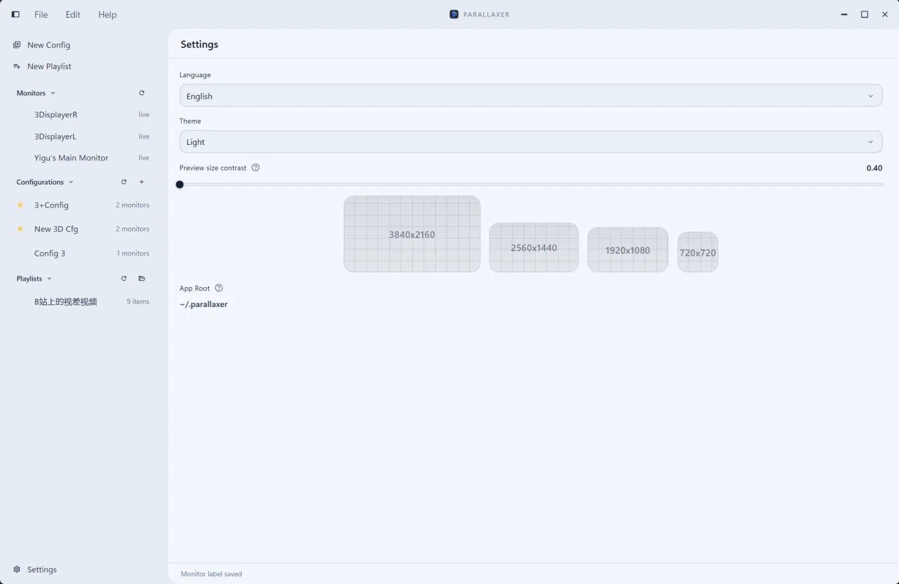

# Parallaxer

[English](../README.md) | [简体中文](./README_zhCN.md)

<p align="center">
  
</p>

<p align="center">
  <a href="https://vuejs.org/">
    
  </a>
  <a href="https://tauri.app/">
    
  </a>
  <a href="https://www.typescriptlang.org/">
    
  </a>
  
  
  
  
  
</p>
<p align="center">
  <a href="https://github.com/POPCORNBOOM/Parallaxer/stargazers">
    
  </a>
</p>

Parallaxer 是一个面向多显示器内容映射与同步播放的桌面应用。它可以把图片或视频映射到 1 块、2 块、3 块甚至更多显示器上，并提供实时预览与校准能力。

技术栈：

- Vue 3
- Vite
- TypeScript
- Tauri 2



## 它是做什么的

Parallaxer 适合这种场景：

- 一张图片或一个视频需要被**自动平分**，并按配置同时分配到多个显示器上展示
- 一组**同名影像**需要通过不同文件夹映射到不同显示器上同时展示
- 播放前需要在真实显示器上实时校准旋转、镜像、缩放和偏移

目前它支持：

- 识别当前在线和历史连接过的显示器
- 给显示器设置人类友好名称
- 创建和复用显示器配置
- 调整配置中的显示器顺序
- 为每块屏设置映射参数：
  - 旋转
  - 镜像
  - X 缩放 / Y 缩放
  - X 偏移 / Y 偏移
- 在真实显示器上打开校准预览
- 基于素材文件夹生成播放列表
- 在多个显示器上同步全屏播放

## 影像如何映射

每个播放列表都绑定：

- 一个素材源文件夹
- 一个配置文件

Parallaxer 支持两种素材来源：

### 1. 根目录共享素材

- 放在播放列表根目录下的图片和视频会被视为共享素材。
- 共享素材会按照所选配置中的显示器数量进行**自动水平平分**。
- 切片会按照配置中的显示器顺序，从左到右映射到各个显示器。
- 也就是说，一张图或一个视频可以自动平分后，同时分配到多个显示器上展示。

### 2. 基于短名称的单屏覆盖素材

- 配置中的每块屏都有一个 `shortName`。
- 如果源文件夹内存在与该 `shortName` 同名的子文件夹，那么该子文件夹中的同名文件会覆盖共享切片。
- 也就是说，一组同名影像可以通过放在不同文件夹中，映射到不同显示器上同时展示。
- 这样你可以在同一个播放列表里混合使用“共享素材”和“单屏专属素材”。

### Guide 示例

步骤 `00`：先选择这个播放列表要使用的配置文件。



步骤 `01`：展示根目录共享素材如何自动水平切分。



步骤 `02`：展示短名称文件夹如何覆盖共享切片。



## 核心概念

### 显示器 Monitor

显示器记录包含：

- 稳定设备标识符
- 系统名称
- 友好名称
- 几何信息与缩放信息
- 当前连接状态
- 上次在线时间

Windows 当前使用的是 EDID 优先的显示器识别链。Linux 和 macOS 也已经接上了非空实现，但 Windows 目前仍然是最完整的平台。



### 配置 Configuration

一个配置定义：

- 哪些显示器参与展示
- 它们的顺序
- 每块屏的 `shortName`
- 每块屏的映射参数

配置文件的**文件名**就是唯一标识符。JSON 里的 `name` 是显示名称，可以修改，但不会反向修改文件名。



### 播放列表 Playlist

一个播放列表代表一个源文件夹，并保存：

- 播放列表名称
- 选中的配置
- 自动生成的播放项
- 每一项的可见性

每个播放列表会直接保存在对应素材目录下的 `playlist.json` 中。


## 数据存储

Parallaxer 会把应用数据保存在项目目录之外。

应用根目录：

- `~/.parallaxer`

当前的落盘结构：

- `~/.parallaxer/.parallaxer`
  - 软件设置
  - 历史显示器缓存
  - 打开过的播放列表文件夹缓存
  - UI 偏好项
- `~/.parallaxer/configurations/*.json`
  - 配置文件
- `<playlist-folder>/playlist.json`
  - 存放在素材目录旁边的播放列表文件

## 播放与预览

Parallaxer 有两种运行时模式：

### 1. 配置预览

- 在目标显示器上打开校准画面
- 显示网格、四角和中心参考点
- 用来实时调整映射参数

### 2. 正式播放

- 在配置中的显示器上打开全屏展示窗口
- 多屏图片/视频同步切换和同步播放
- 在展示焦点内响应键盘控制
- 只播放第一个可用视频来源的音频

## 当前状态

项目当前主要聚焦在：

- Windows 优先的多显示器工作流
- 需要频繁校准的展示场景
- 多屏媒体映射与同步播放

Linux 和 macOS 的显示器 ID 读取链已经接上，但显示器身份识别这一块目前仍是 Windows 最成熟。

## 开发

### 依赖要求

你需要：

- Node.js
- npm
- Rust toolchain
- 当前平台对应的 Tauri 2 前置环境

参考：

- [Tauri prerequisites](https://v2.tauri.app/start/prerequisites/)

### 安装依赖

```bash
npm install
```

### 启动桌面开发环境

```bash
npm run tauri dev
```

### 只启动前端开发服务器

```bash
npm run dev
```

### 构建

```bash
npm run build
```

### 测试

```bash
npm test
```

## 目录结构

```text
src/                 Vue UI、状态管理、映射逻辑
src-tauri/           Tauri 宿主、显示器识别、文件系统、播放窗口
docs/                项目文档
original_prompt.md   最初的产品方向 prompt
```

## 说明

- 主窗口使用自绘标题栏和自定义壳层布局。
- 配置和播放列表采用防抖自动保存。
- 历史显示器即使当前断开，也会继续保留在显示器列表中。

## 主题

Parallaxer 支持：

- 深色模式
- 浅色模式
- 跟随系统



## License

当前仓库还没有附带 license 文件。
